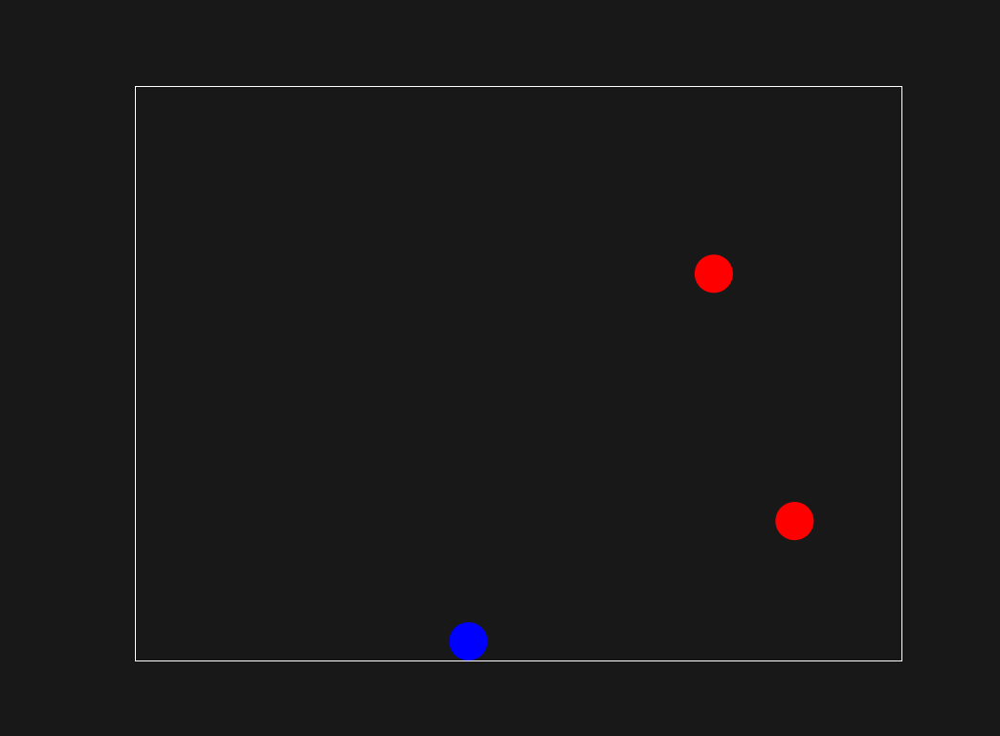

# Bounce The Ball

> [!WARNING]
> This is a work In Progress! Anything can change at any moment without any notice!

A simple bounce-the-ball simulation with physics engine written from scratch.
The engine is written in Go, the configurations and objects are written in lua and rendering is
written in TypeScript + HTML 2D canvas



Deployed to Github Pages here: https://tgarif.github.io/bounce-the-ball/

## Quick Start

```console
$ make
$ make serve
$ <browser> https://localhost:8080
```

This script starts up vite server at http://localhost:8080/ to serve the content of the dist folder

## References

- Physics implementation is heavily inspired from the book: "_Game Physics Engine Development by Ian
  Millington_"
